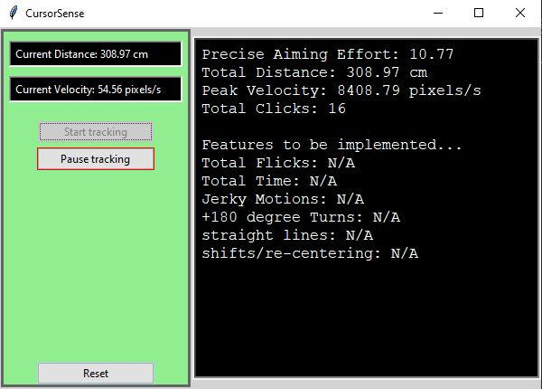
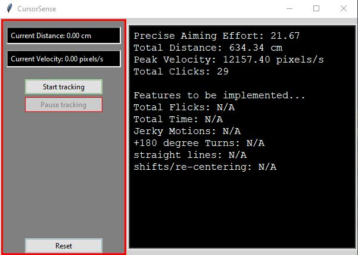
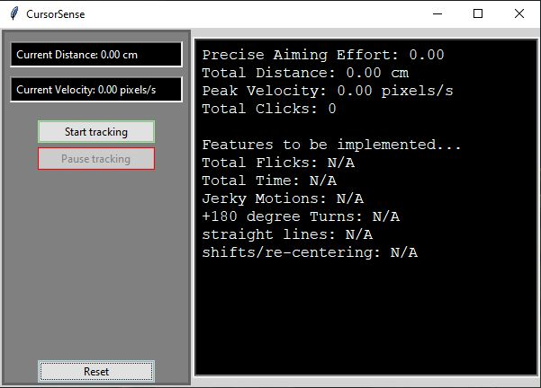
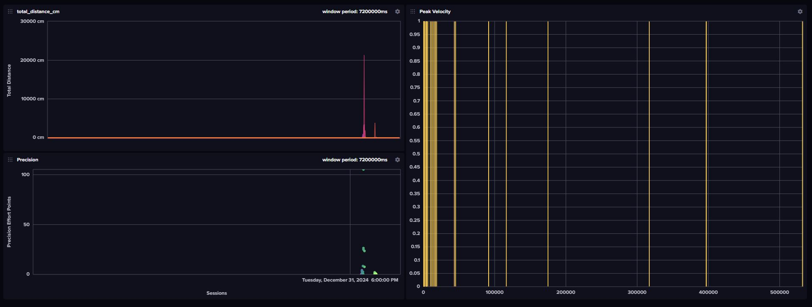

# CursorSense.v1

## Project Status
This version of CursorSense has been archived due to performance considerations. Development shift to a new, more optimized approach on lightweight data collection and processing.

## Overview
A Python-based tool designed to help gamers optimize their training sessions by tracking and analyzing mouse input data.

## Key Features
- Real-time mouse input tracking 
- Session-based data collection and analysis 
- Interactive user interface for session management 
- Data visualization of movement patterns and statistics 
- Automated fatigue detection and break recommendations

## Technical Architecture
- Mouse movement tracking using Python's pynput library
- Data storage and analysis with Pandas
- GUI implementation with Tkinter
- Future ML/AI integration for pattern recognition

## Development Roadmap
### Phase 1 - Core Functionality
- Mouse tracking 
- Basic data collection 
- Simple user interface 
### Current Application States

[Start]

[Pause]

[Reset]

### Phase 2 - Data Analysis 
- Statistical analysis of movement patterns
- Historical data visualization
- Session comparison tools

[InfluxDB]

### Phase 3 - AI Integration 
- Movement pattern recognition
- Fatigue detection algorithms
- Automated break recommendations
